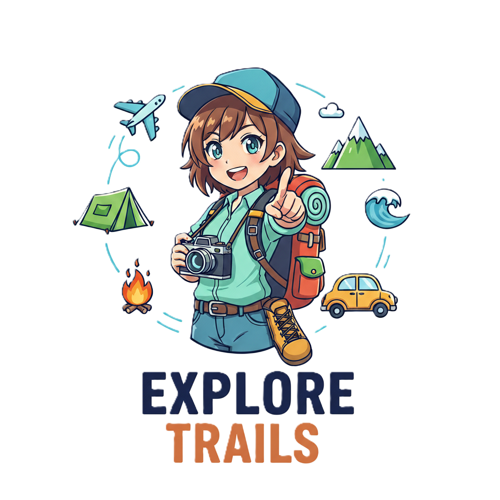
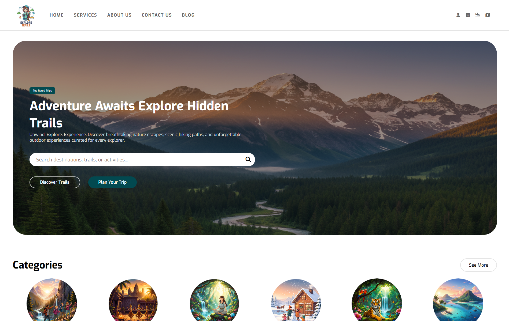

<!-- PROJECT LOGO -->

  

  <h1 align="center">🌏 Explore Trail 🌏</h1>
  

    A modern vocational website in Cambodia, created to provide career guidance, training information, and resources for students and professionals.
    This project is built using <strong>HTML and CSS</strong> with a fully <strong>responsive design</strong> to ensure smooth navigation on desktop, tablet, and mobile devices.
    The website focuses on delivering clear, organized content to help users explore courses, vocational opportunities, and educational resources easily.
    It is designed with simplicity and usability in mind, making it easy for anyone to find relevant information about skills development and career growth.
  

  <a href="https://exploretrails.vercel.app/">View Demo</a>

  

